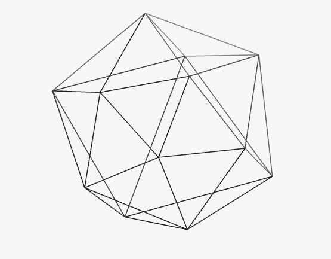
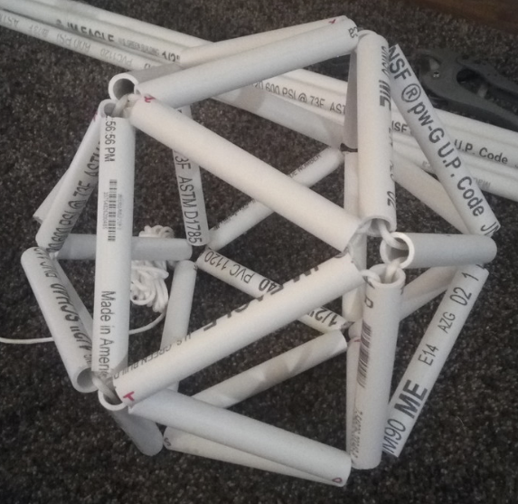

# pipedream
Convert STL meshes into instructions for building physical wireframes with rigid pipe & string

 

# Example

Icosahedron (shown above)

    $ ./pipedream.py --icosahedron
    Bill of Materials
    =================
    Pipe   A, length=1.105
    Pipe   B, length=1.105
    Pipe   C, length=1.105
    Pipe   D, length=1.105
    Pipe   E, length=1.105
    Pipe   F, length=1.105
    Pipe   G, length=1.105
    Pipe   H, length=1.105
    Pipe   I, length=1.105
    Pipe   J, length=1.105
    Pipe   K, length=1.105
    Pipe   L, length=1.105
    Pipe   M, length=1.105
    Pipe   N, length=1.105
    Pipe   O, length=1.105
    Pipe   P, length=1.105
    Pipe   Q, length=1.105
    Pipe   R, length=1.105
    Pipe   S, length=1.105
    Pipe   T, length=1.105
    Pipe   U, length=1.105
    Pipe   V, length=1.105
    Pipe   W, length=1.105
    Pipe   X, length=1.105
    Pipe   Y, length=1.105
    Pipe   Z, length=1.105
    Pipe  AA, length=1.105
    Pipe  AB, length=1.105
    Pipe  AC, length=1.105
    Pipe  AD, length=1.105

    Total length: 33.15

    Assembly Steps
    ==============
    Step   1: into pipe A front (new)
    Step   2: into pipe B front (new)
    Step   3: into pipe C front (new)
    Step   4: into pipe D front (new)
    Step   5: into pipe E front (new)
    Step   6: into pipe F front (new)
    Step   7: into pipe D front 
    Step   8: into pipe G front (new)
    Step   9: into pipe H front (new)
    Step  10: into pipe I front (new)
    Step  11: into pipe J front (new)
    Step  12: into pipe K front (new)
    Step  13: into pipe E back 
    Step  14: into pipe J front 
    Step  15: into pipe L front (new)
    Step  16: into pipe M front (new)
    Step  17: into pipe N front (new)
    Step  18: into pipe O front (new)
    Step  19: into pipe P front (new)
    Step  20: into pipe Q front (new)
    Step  21: into pipe R front (new)
    Step  22: into pipe P front 
    Step  23: into pipe S front (new)
    Step  24: into pipe O front 
    Step  25: into pipe T front (new)
    Step  26: into pipe N front 
    Step  27: into pipe U front (new)
    Step  28: into pipe H back 
    Step  29: into pipe V front (new)
    Step  30: into pipe S back 
    Step  31: into pipe B front 
    Step  32: into pipe V front 
    Step  33: into pipe U front 
    Step  34: into pipe M front 
    Step  35: into pipe W front (new)
    Step  36: into pipe X front (new)
    Step  37: into pipe Y front (new)
    Step  38: into pipe K back 
    Step  39: into pipe X front 
    Step  40: into pipe Z front (new)
    Step  41: into pipe T back 
    Step  42: into pipe AA front (new)
    Step  43: into pipe AB front (new)
    Step  44: into pipe AC front (new)
    Step  45: into pipe Y back 
    Step  46: into pipe AB front 
    Step  47: into pipe R front 
    Step  48: into pipe AA front 
    Step  49: into pipe Z front 
    Step  50: into pipe W front 
    Step  51: into pipe L front 
    Step  52: into pipe I front 
    Step  53: into pipe G front 
    Step  54: into pipe C front 
    Step  55: into pipe A front 
    Step  56: into pipe Q front 
    Step  57: into pipe AD front (new)
    Step  58: into pipe F back 
    Step  59: into pipe AC back 
    Step  60: into pipe AD front 
    Step  61: into pipe A front 
            ...and tie off
